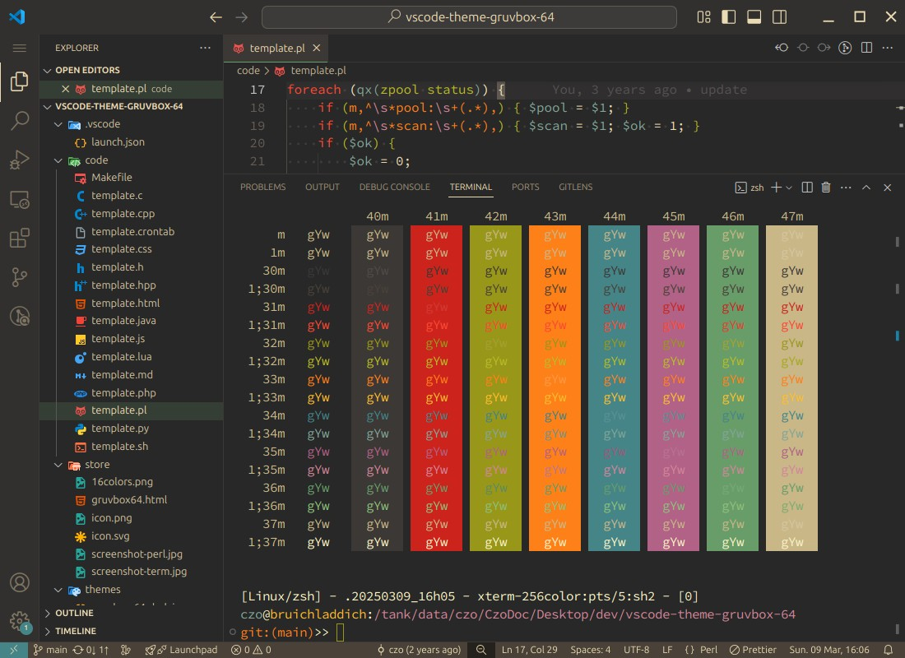
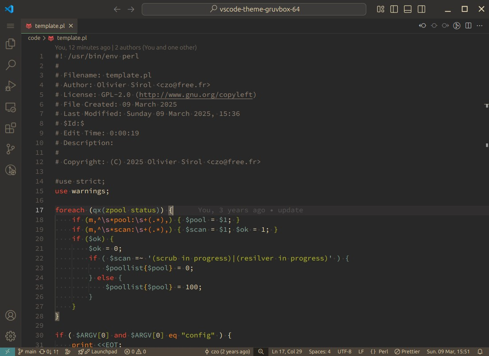

<!--
// Filename: README.md
// Author: Olivier Sirol <czo@free.fr>
// License: GPL-2.0 (http://www.gnu.org/copyleft)
// File Created: nov. 2021
// Last Modified: Tuesday 25 November 2025, 21:36
// Edit Time: 0:48:50
-->

<h1 align="center">
  <br>
  <a href="https://marketplace.visualstudio.com/items?itemName=czo64.gruvbox-64">
    
  </a>
  <br>
  Gruvbox 64
  <br>
</h1>

<h4 align="center">A port of my Gruvbox 64 theme from vim to the VS Code editor</h4>

## About

It's a [gruvbox](https://github.com/morhetz/gruvbox) 64 theme including syntax highlighting and workbench & terminal colors. You can get it on [marketplace](https://marketplace.visualstudio.com/items?itemName=czo64.gruvbox-64).

## Gruvbox 64

My gruvbox-64 is a modified gruvbox theme.
It's a 16 colors palette with a modified light white (
<span style="color:black; background-color:#ebdbb2">#ebdbb2</span> ->
<span style="color:black; background-color:#fbf1c7">#fbf1c7</span>
), dark white (
<span style="color:black; background-color:#a89984">#a89984</span> ->
<span style="color:black; background-color:#c9b788">#c9b788</span>
), light black - which is gray in gruvbox - near brown (
<span style="color:black; background-color:#928374">#928374</span> ->
<span style="color:white; background-color:#4a4239">#4a4239</span>
), and the yellow is orange (
<span style="color:black; background-color:#d79921">#d79921</span> ->
<span style="color:black; background-color:#fe8019">#fe8019</span>
)


- This theme has no bold and no italic.

- Bracket pair with gruvbox64 colors

- Has editorStickyScroll

- The $ in shell is the same color as the variable.

- It colorize html entity in orange

- It colorize perl's functions

I use gruvbox-64 in terminal and vim. Now it's for VSCode !

## What's new

* 2025-11:
  - missing #689d6a40 panelTitle.activeBorder

* 2025-10:
  - titleBar: use #21201d (a darker grey near brow) for background and a ligther foreground
  - editorStickyScroll: show brown border and lightly visible background
  - editorOverviewRuler: lightly visible brown
  - scrollbarSlider: from green to brown

* 2025-03:
  - color change wordHighlight FindMatchHighlight and selectionHighlight
  - darker editorStickyScroll

* 2024-09:
  - titleBar and activityBar lighter color
  - change color in diffEditor

* 2024-05:
  - color change in gitDecoration  editorWhitespace  editorStickyScroll and darker Selection

* 2024-03:
  - StickyScroll colors!

* 2022-05:
  - bracketpair with gruvbox64 color

* 2021-12:
  - brighter colors in menus and widgets
  - statusBar.noFolderBackground brown like in vim

## Installation

Launch _Quick Open_

-  <a href="https://code.visualstudio.com/shortcuts/keyboard-shortcuts-linux.pdf">Linux</a> `Ctrl+P`
-  <a href="https://code.visualstudio.com/shortcuts/keyboard-shortcuts-macos.pdf">macOS</a> `⌘P`
-  <a href="https://code.visualstudio.com/shortcuts/keyboard-shortcuts-windows.pdf">Windows</a> `Ctrl+P`

Paste the following command and press `Enter`:

```
ext install czo64.gruvbox-64
```

## Variants

- Dark - Medium Contrast

## Screenshots

On March 2022 the default value for the integrated terminal "minimum contrast ratio" was updated from 1 (no effect) to 4.5 (minimal effect). To disable this feature, override the default in your own settings.json file:

    "terminal.integrated.minimumContrastRatio": 1



Screenshot of perl code:




## Contributing

Please, report issues/bugs and suggestions for improvements to the issue [here](https://github.com/czodroid/vscode-theme-gruvbox-64/issues).

### Tips

- In the `json` file, `scope` can be an `array` or a `string` of CSS classes
- VSCode's `Developer: Inspect TM Scopes` command is useful to find out the scope
- `colors.txt` contains available colors

## Credits

Special thank to [Pavel Pertsev](https://github.com/morhetz), the creator of [gruvbox](https://github.com/morhetz/gruvbox) original theme.

And of course [JD](https://github.com/jdinhify), the creator of [vscode-theme-gruvbox](https://github.com/jdinhify/vscode-theme-gruvbox), from whom I did use vscode-theme-gruvbox as start.


Thanks for help to make the Gruvbox theme better.
