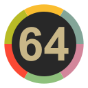
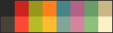
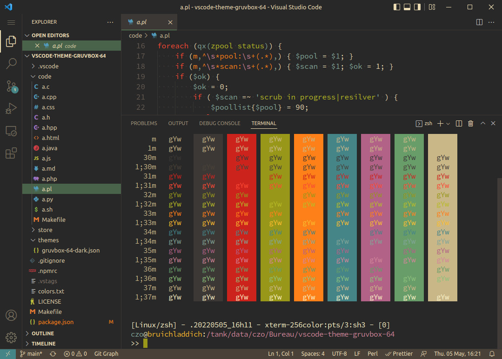

<h1 align="center">
  <br>
  <a href="https://marketplace.visualstudio.com/items?itemName=czo64.gruvbox-64">
    
  </a>
  <br>
  Gruvbox 64
  <br>
</h1>

<h4 align="center">A port of my Gruvbox 64 theme to VS Code editor</h4>


## About

A [gruvbox](https://github.com/morhetz/gruvbox) 64 theme including syntax highlighting and workbench & terminal colors.

## Gruvbox 64

My gruvbox-64 is a modified gruvbox theme.
It's a 16 colors palette whith light white (#ebdbb2 -> #fbf1c7) and dark white (#a89984 -> #c9b788) modified
and light black (which is gray in gruvbox) near brown (#928374 -> #4a4239):



I did use vscode-theme-gruvbox as start, which is Copyright (C) 2017 [JD](https://github.com/jdinhify)

- This theme has no bold and no italic. 

- The $ in shell is the same color as the variable.

- It colorize html entity in orange

- It colorize perl's functions

I use it in terminal and vim. Now it's for VSCode !

## Installation

Launch *Quick Open*

  -  <a href="https://code.visualstudio.com/shortcuts/keyboard-shortcuts-linux.pdf">Linux</a> `Ctrl+P`
  -  <a href="https://code.visualstudio.com/shortcuts/keyboard-shortcuts-macos.pdf">macOS</a> `⌘P`
  -  <a href="https://code.visualstudio.com/shortcuts/keyboard-shortcuts-windows.pdf">Windows</a> `Ctrl+P`

Paste the following command and press `Enter`:

```
ext install czo64.gruvbox-64
```

## Variants

-   Dark - Medium Contrast
> -   Dark - Hard Contrast
> -   Dark - Soft Contrast
> -   Light - Medium Contrast
> -   Light - Hard Contrast
> -   Light - Soft Contrast

## Screenshots



## Contributing

Please, report issues/bugs and suggestions for improvements to the issue [here](https://github.com/czodroid/vscode-theme-gruvbox-64/issues).

### Tips

-   In the `json` file, `scope` can be an `array` or a `string` of CSS classes
-   VSCode's `Developer: Inspect TM Scopes` command is useful to find out the scope
-   `colors.txt` contains available colors

## Release Notes

See [changelog](CHANGELOG.md).

## Credits

Special thank to [Pavel Pertsev](https://github.com/morhetz), the creator of [gruvbox](https://github.com/morhetz/gruvbox) original theme.

And of course [JD](https://github.com/jdinhify), the creator of [vscode-theme-gruvbox](https://github.com/jdinhify/vscode-theme-gruvbox)

Thanks for help to make the Gruvbox theme better.


